<!-- author: hgbaodev -->
# Đồ án môn Phân tích thiết kế hệ thống thông tin
 Đề tài: Quản lý kho hàng điện thoại thông minh theo mã imei
 ### 
 File báo cáo vào slide PowerPoint nằm trong thư mục BaoCaoPTTKHTTT

## Getting Started

1. Tải source code về:

   ```bash
   git clone https://github.com/hgbaodev/QuanLyKhoDienThoai.git
   ```
2. Mở xampp và vào trang http://localhost/phpmyadmin/ tạo 1 database mới có tên là quanlikhohang và import cơ sở dữ liệu trong folder database -> file quanlikhohang.sql trong source code.

3. Sử dụng netbeans để chạy source code.
### Tài khoản Admin
- Username: admin
- Password: 123456
### Giao diện
 
 
 <h4 align="center">Đăng nhập</h4>
 
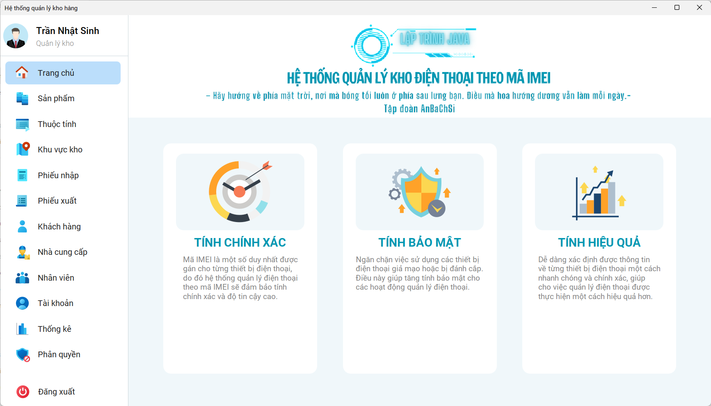

 <h4 align="center">Trang chủ</h4>
 
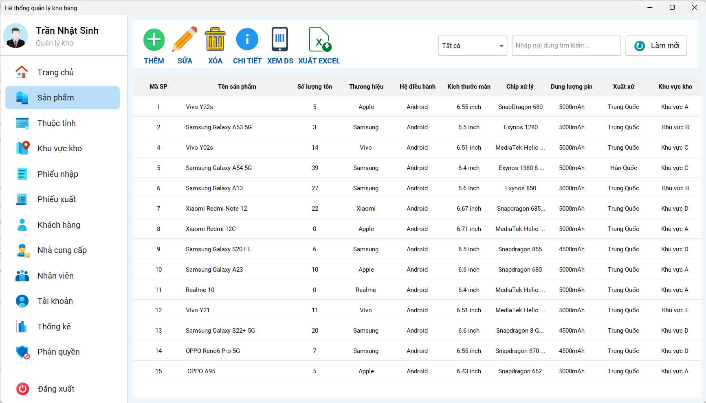

 <h4 align="center">Sản phẩm</h4>
 
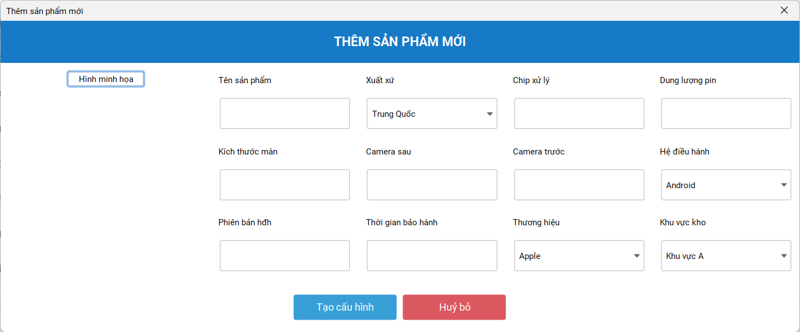

 <h4 align="center">Thêm sản phẩm</h4>
 
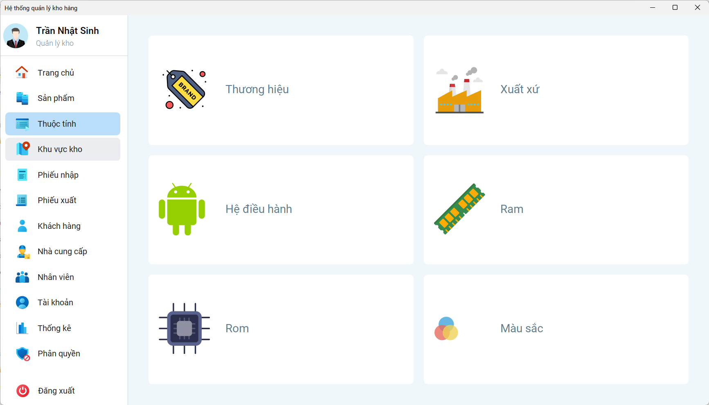

 <h4 align="center">Thuộc tính</h4>
 
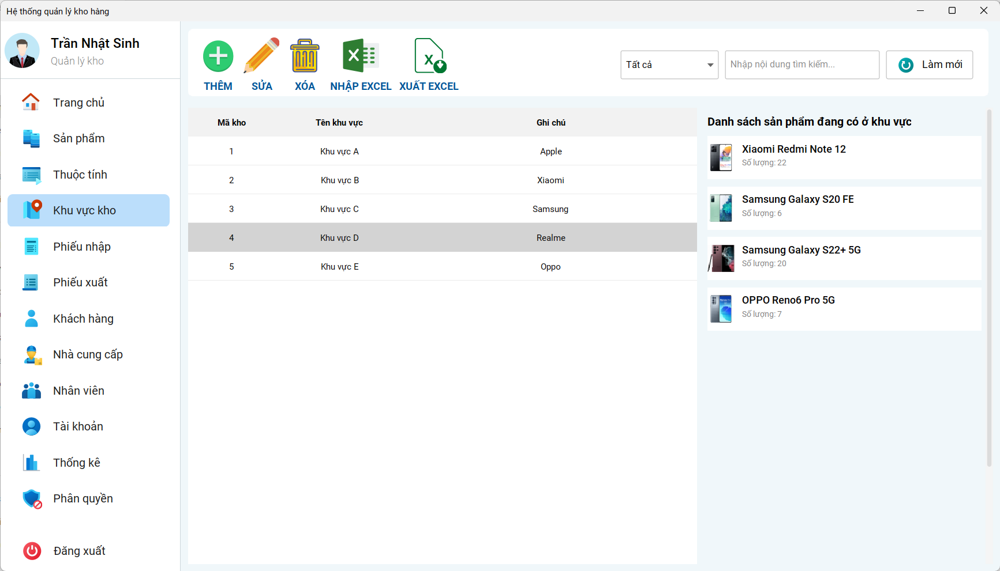

 <h4 align="center">Khu vực kho</h4>
 
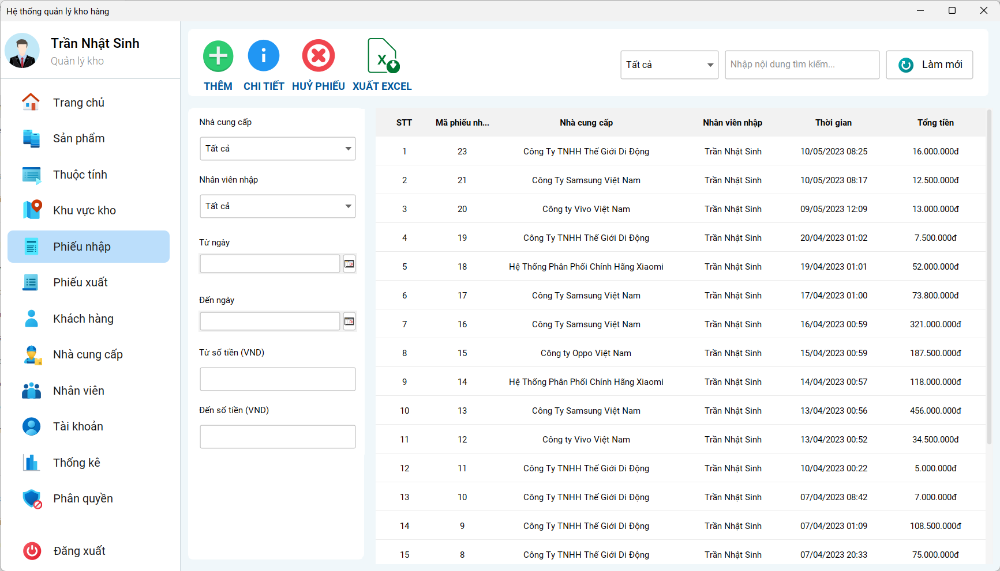

 <h4 align="center">Phiếu nhập</h4>
 
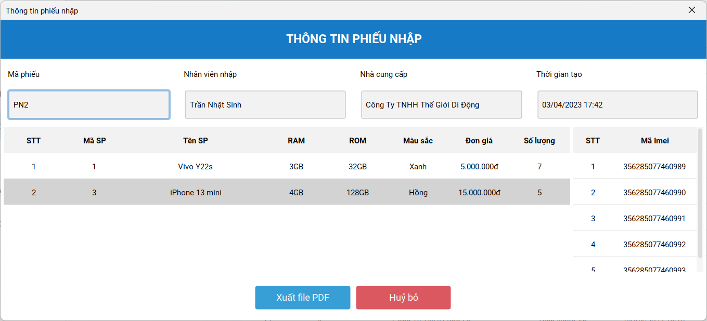

 <h4 align="center">Chi tiết phiếu nhập</h4>
 
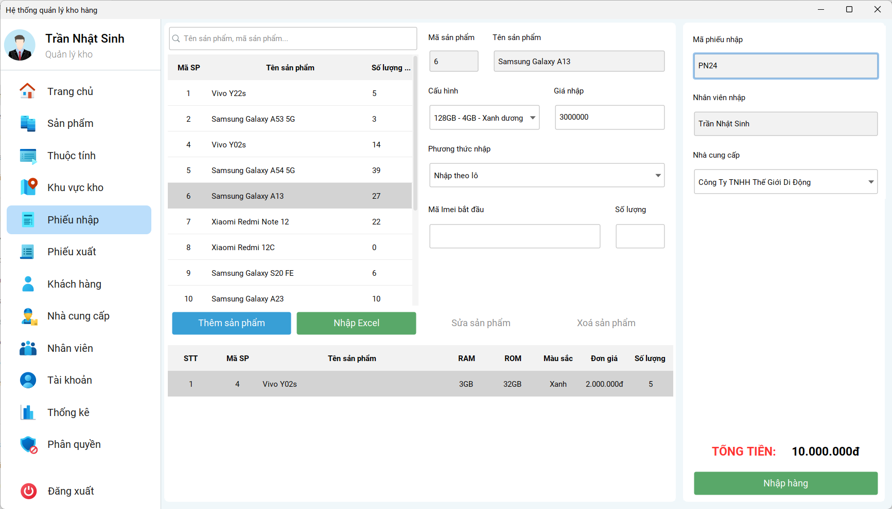

 <h4 align="center">Tạo phiếu nhập</h4>
 
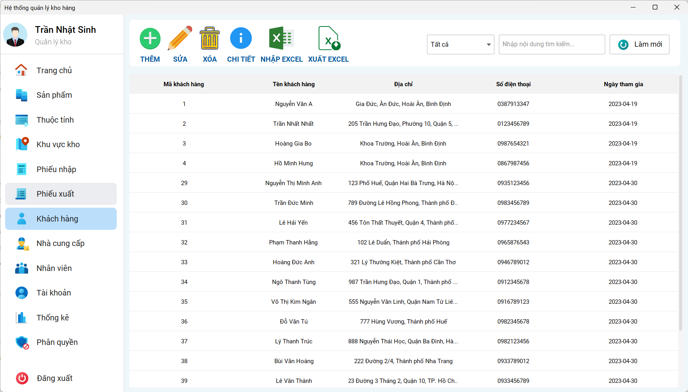

 <h4 align="center">Khách hàng</h4>
 
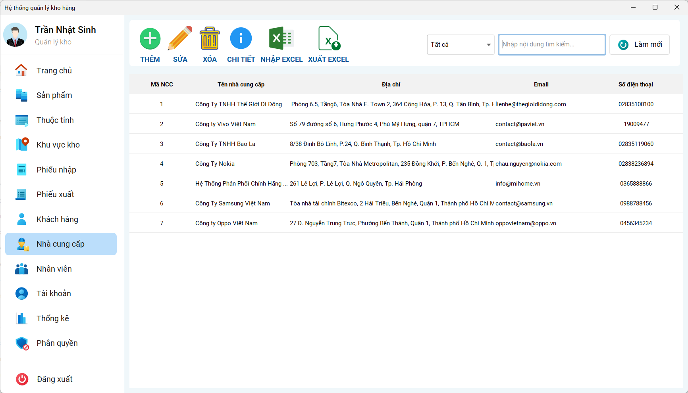

 <h4 align="center">Nhà cung cấp</h4>
 
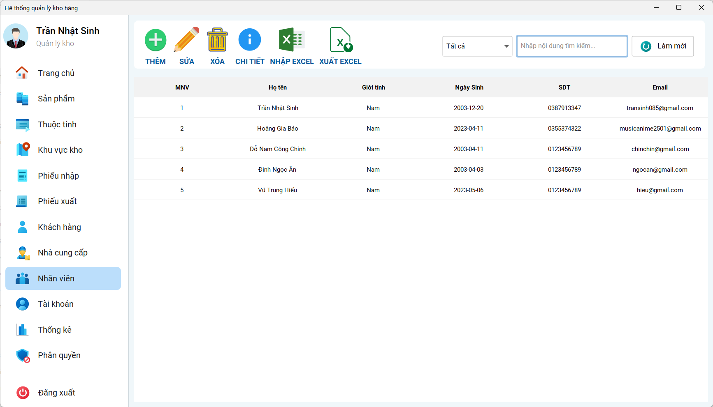

 <h4 align="center">Nhân viên</h4>
 
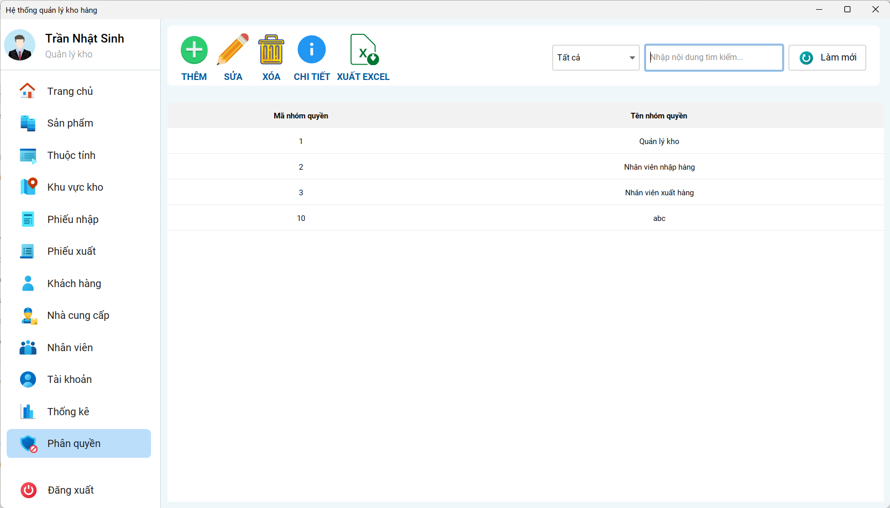

 <h4 align="center">Nhân viên</h4>
 
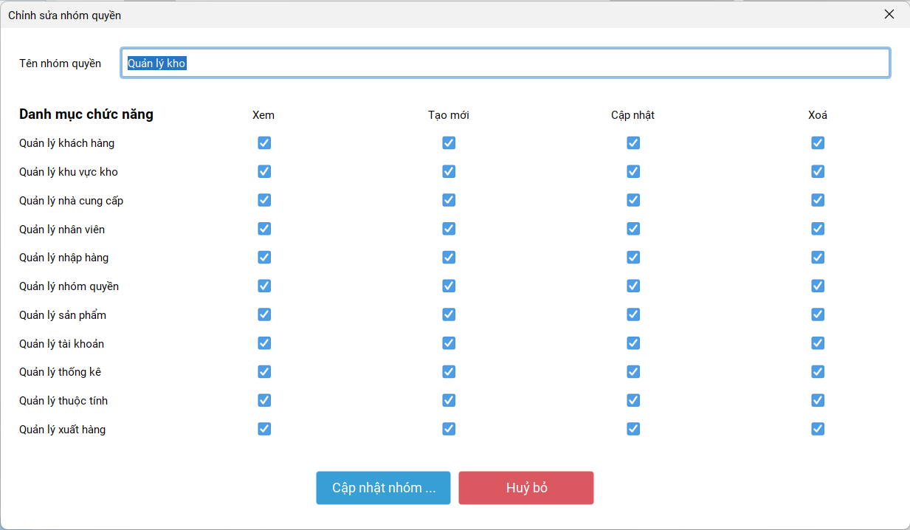

 <h4 align="center">Chi tiết quyền</h4>
 
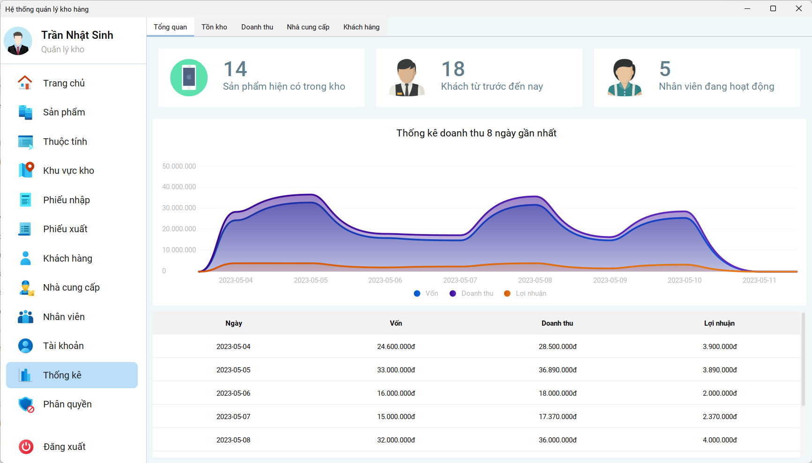
 <h4 align="center">Tổng quan</h4>
 
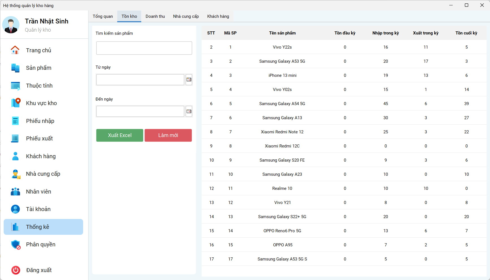

 <h4 align="center">Thống kê tồn kho</h4>
 
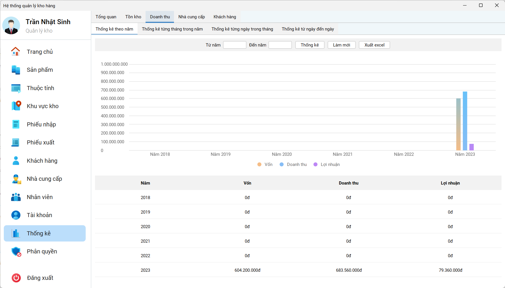

 <h4 align="center">Thống kê doanh thu năm</h4>
 
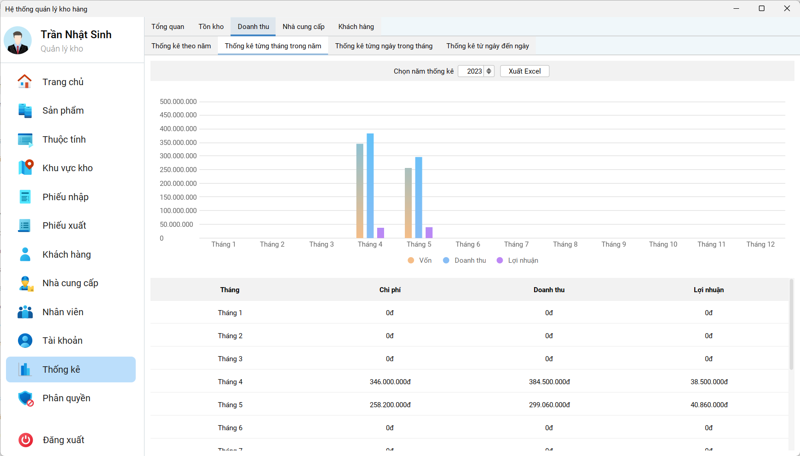

 <h4 align="center">Thống kê doanh thu tháng</h4>
 
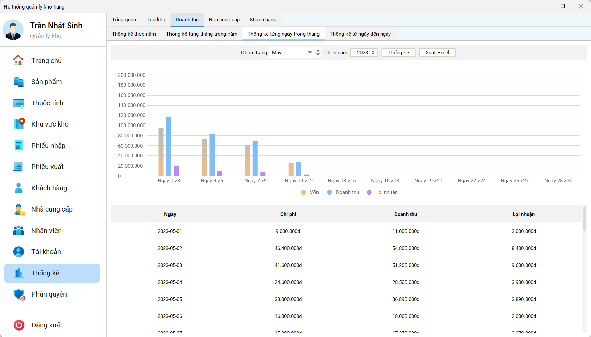

 <h4 align="center">Thống kê doanh thu từng ngày trong tháng</h4>
